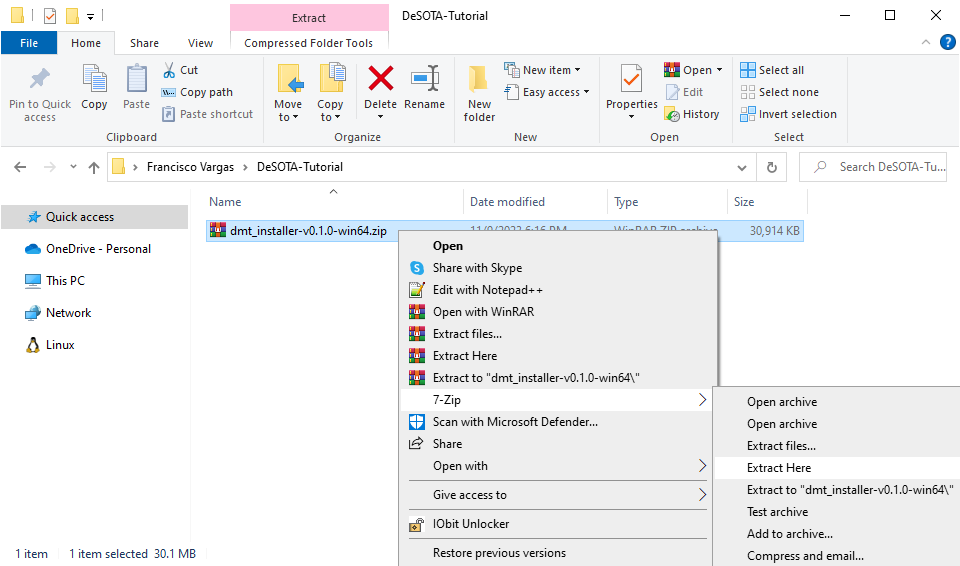
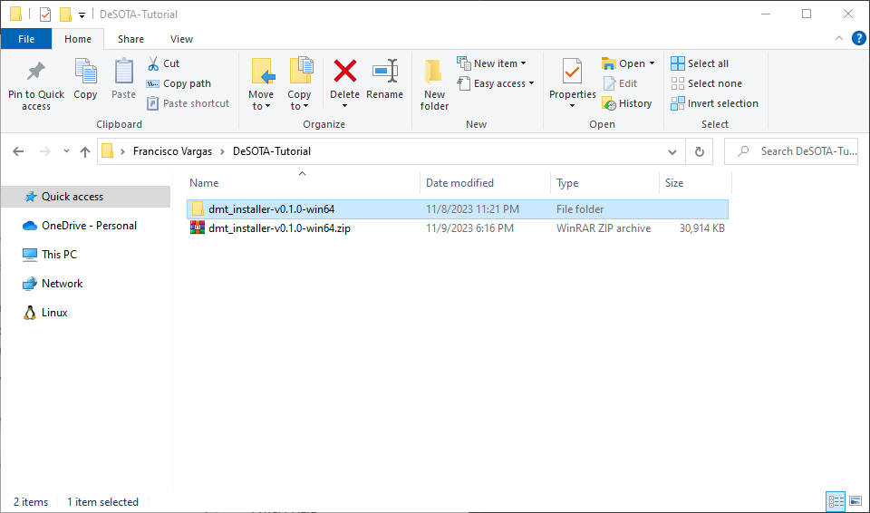
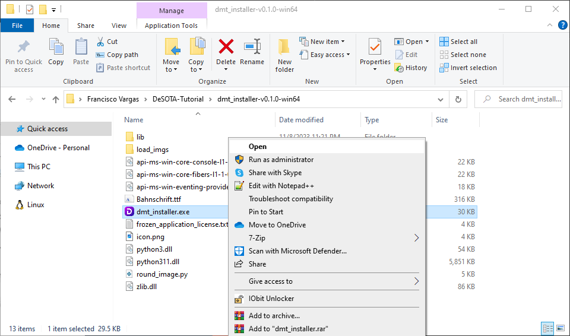

# Download Installer Build

# Uncompress Download

1. Right click on .zip file and press `Extract Here`

    

2. Open Extracted Folder
    
    

# Launch Installer

3. Run Installer without administrator
    
    File name: `dmt_installer.exe`

    

## After a few seconds this gui will pop-up

