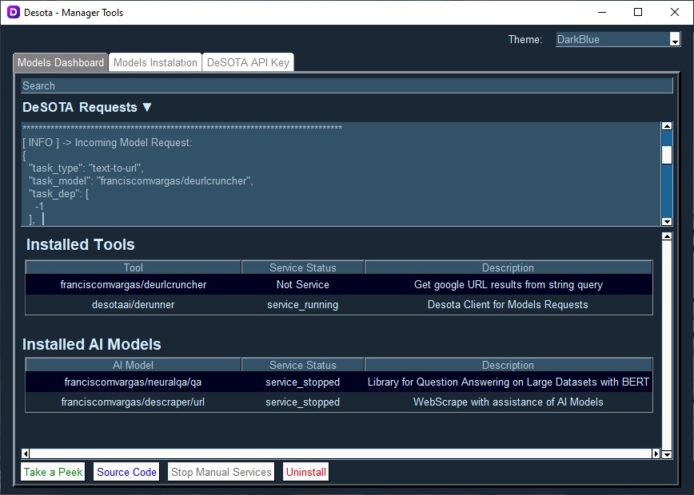

<details open>
   <summary><h1>DeManagerTools Overview</h1></summary>

DeManagerTools consists on a GUI to:
 - Manage `DeSOTA Tools` (eg. [DeRunner](https://github.com/desotaai/derunner), [DeUrlCruncher](https://github.com/franciscomvargas/DeUrlCruncher)) and `DeSOTA AI Models` (eg. [DeScraper](https://github.com/franciscomvargas/descraper), [NeuralQA](https://github.com/franciscomvargas/neuralqa)):
    - Install;
    - Upgrade;
    - Uninstall.
 - Connect to multiple `DeSOTA Tools` / `DeSOTA AI Models` dedicated User Interfaces;
 - Create DeSOTA API Key.

</details>

<details open>
   <summary><h1>Instalation</h1></summary>

## Windows

* Go to CMD (command prompt):
    * <kbd>⊞ Win</kbd> + <kbd>R</kbd>
    * Enter: `cmd` 

* Paste the following comand: 
    ```cmd
    powershell -command "Invoke-WebRequest -Uri https://github.com/DeSOTAai/DeManagerTools/releases/download/v0.0.1/dmt_installer.exe -OutFile %UserProfile%\dmt_installer.exe" && %UserProfile%\dmt_installer.exe && del %UserProfile%\dmt_installer.exe

    ```
    
<!-- [](https://github.com/DeSOTAai/DeManagerTools/releases/download/v0.0.1/dmt_installer.exe) -->

<!-- TODO: Convert desota host into HTTPS -->
<!-- [](http://129.152.27.36/assistant/download.php?system=win&file=demanagertools) -->

<!-- 1. Uncompress File
2. Run .EXE file -->

</details>

<details open>
   <summary><h1>About DeManagerTools</h1></summary>
 
<details open>
   <summary><h2>Install / Upgrade DeSOTA Models and Tools</h2></summary>


 ### Sections

- **Available Tools**: This section have the latest version of uninstalled `DeSOTA Tools`;
- **Available AI Models** - This section have the latest version of uninstalled `DeSOTA AI Models`;
- **Available Upgrades** - This section have the upgrades available for `DeSOTA Tools` and `DeSOTA AI Models`. 

 ### Buttons

 - **Source Code**: Open in the browser the `DeSOTA AI Model` / `DeSOTA Tool` repository;
 - **Check 4 Upgrades**: Update [DeSOTA Services/Tools Params](#desota-services--tools-params).
 - **Start Instalation**: Install selected `DeSOTA Tools` / `DeSOTA AI Models`.

</details>

<details open>
   <summary><h2>Models / Tools Dashboard</h2></summary>

 

 ### Sections
- **DeSOTA Requests**: Live log of [DeRunner](https://github.com/desotaai/derunner)
- **Installed Tools**: Information about `DeSOTA Tools`;
- **Installed AI Models** - Information about  `DeSOTA AI Models`;

 ### Buttons

 - **Take a Peek**: Open selected `DeSOTA AI Models` / `DeSOTA Tools` UI (User Interface) if exist;
   - **Note**: If service of model / tool <ins>don't run constantly</ins> is required to stop service after closing the UI:
      - by pressing the button `Stop Manual Services`
      - by closing the APP
 - **Source Code**: Open in the browser the selected `DeSOTA AI Models` / `DeSOTA Tools` repository;
 - **Stop Manual Services**: Stop all started `DeSOTA AI Models` / `DeSOTA Tools` that <ins>don't run constantly</ins> after `Take a Peek`;
 - **Uninstall**: Uninstall selected `DeSOTA Tools` / `DeSOTA AI Models`.

</details>

<details open>
    <summary><h2>DeSOTA API Key</h2></summary>

 

  - Under development...

</details>

<details open>
    <summary><h2>Upgrade DeManagerTools</h2></summary>

  If new version of the app is available you'll be prompted with a pop-up similar to:

  

</details>

 ## DeSOTA Services / Tools Params

  The latest DeSOTA Services/Tools Params are available [here](https://github.com/DeSOTAai/DeRunner/blob/main/Assets/latest_services.config.yaml).
  

</details>
